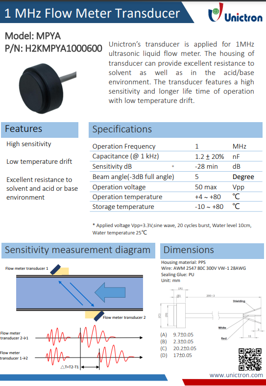
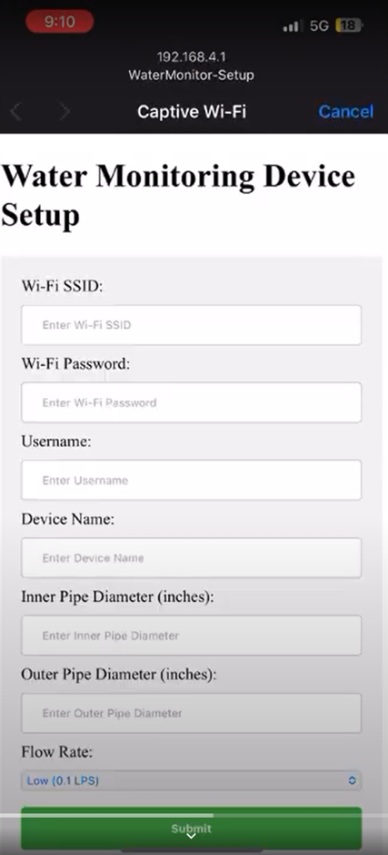
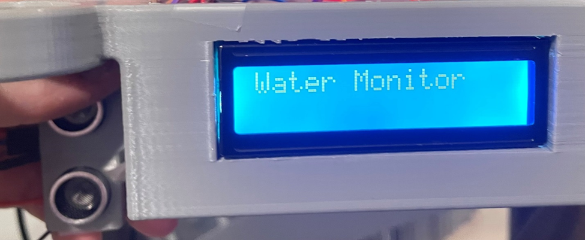

# ECE445 Senior Design Journal - Household Water Monitoring System - Advait Renduchintala

---

## Project Overview
**Project Name**: Household Water Monitoring System  
**Team Member(s)**: Advait Renduchintala (advaitr3)  
**Date Started**: 09/16/2024  
**Course**: ECE445 Senior Design  

---

## Table of Contents
1. [Week 1](#week-1)  
2. [Week 2](#week-2)  
3. [Week 3](#week-3)  
4. [Week 4](#week-4)  
5. [Week 5](#week-5)  
6. [Week 6](#week-6)  
7. [Week 7](#week-7)  
8. [Week 8](#week-8)  
9. [Week 9](#week-9)  
10. [Week 10](#week-10)  
11. [Week 11](#week-11) 
12. [Week 12](#week-12)   
13. [Week 13](#week-13) 

---

## Week 1
**Dates**: [9/16-9/21]  
**Goals for the Week**:  
- Started first draft of project proposal  
- Meet with TA to discuss design and get project approved  

**Tasks Completed**:  
During the first week of the project, I focused on creating a high-level block diagram to outline the design of our Household Water Monitoring System. This involved dividing the system into key subsystems: the frontend for user interaction, API endpoints for data communication, and a database to store water usage data. For the database, we explored using AWS DynamoDB, a scalable NoSQL database designed for real-time data handling [1]. To facilitate seamless communication between the frontend and the database, I also began planning the implementation of AWS Lambda functions, which enable serverless API endpoints for data processing [2].

With Daniel, I spent significant time understanding the capabilities and limitations of the ESP32 microcontroller. We reviewed its datasheet and referred to online tutorials to understand its GPIO pin configurations and communication protocols [3]. Initially, we planned to integrate the ESP32 as the central device for data collection, using its Wi-Fi capabilities to send sensor data to AWS DynamoDB via the Lambda functions. This integration aimed to ensure real-time monitoring and minimal latency between the hardware and cloud components.

Additionally, I worked on defining three high-level requirements for our system, focusing on functionality, scalability, and usability. I also started drafting the project proposal, which detailed the system’s architecture and the roles of each subsystem. By the end of the week, I completed my sections of the draft project proposal, ensuring it had all necessary technical and design details.

**Challenges**:  
- Understanding ultrasonic sensor's datasheet and how to integrate it into the project. There is not much description in this picture.
Jack breadboarded this to test it out, I have not thought about integration yet.

**Next Steps**:  
- Drill down design and finish first draft of project proposal  

**Bibliography**:
1. AWS. "Amazon DynamoDB Documentation." AWS Documentation. Available at: https://docs.aws.amazon.com/amazondynamodb/
2. AWS. "AWS Lambda Documentation." AWS Documentation. Available at: https://docs.aws.amazon.com/lambda/
3. Espressif Systems. "ESP32 Technical Reference Manual." Espressif Systems. Available at: https://www.espressif.com/en/products/socs/esp32/resources

---

## Week 2
**Dates**: [9/23-9/28]  
**Goals for the Week**:  
- Start Design Review  

**Tasks Completed**:  
During this week, I focused on completing the rough draft of the design review by thoroughly documenting the system's architecture 
and subsystem requirements. My contribution was developing the Requirement and Verification (R&V) tables for the software 
subsystems. This included detailing the expected functionalities of the API endpoints, database operations, and frontend components, 
along with the specific tests to verify their performance. For instance, I specified that the API endpoints, implemented using AWS
Lambda, should handle requests with a latency of less than 200ms under normal load conditions and outlined verification steps using   mock testing frameworks [1][2].

Additionally, I collaborated with my teammate Daniel to work on the microcontroller and LCD subsystem descriptions. Together, 
we defined the core requirements for these hardware components, such as the ESP32 microcontroller's ability to accurately process 
data from ultrasonic sensors and communicate via SPI or I2C protocols [3]. For the LCD subsystem, I helped draft requirements ensuring 
clear and consistent display output, even under varying lighting conditions. We also formulated corresponding verification methods, 
such as testing the LCD's refresh rate and legibility at different viewing angles [4].

This collaboration allowed us to ensure that all critical subsystems had comprehensive R&V tables, which would serve as a 
roadmap for testing and validation in later phases. By the end of the week, we completed a solid rough draft of the design review, 
which covered both the hardware and software components, setting the foundation for further development and refinement.

**Challenges**:  
- Our project requires many systems that we have little experience with, so we needed to research a lot to figure out our design review. 
We Did this by reading a lot of documents and diagrams. We refrenced the ESP32 S3 Wroom 1 manaul and this pin out to think ahead 
about breadboarding. One more challenge we had was to figure what parts we exactly needed, so we'll work on that more next week.

**Next Steps**:  
- Finalize Design Review  

**Bibliography**:
1. AWS. "Amazon DynamoDB Documentation." AWS Documentation. Available at: https://docs.aws.amazon.com/amazondynamodb/
2. AWS. "AWS Lambda Documentation." AWS Documentation. Available at: https://docs.aws.amazon.com/lambda/
3. Espressif Systems. "ESP32 Technical Reference Manual." Espressif Systems. Available at: https://www.espressif.com/en/products/socs/esp32/resources
4. Adafruit Industries. "LCD Displays Overview and Documentation." Adafruit. Available at: https://learn.adafruit.com/character-lcds
5. FluidNC. "ESP32-S3 Pin Reference." Available at: http://wiki.fluidnc.com/en/hardware/ESP32-S3_Pin_Reference
---

## Week 3
**Dates**: [9/30-10/4]  
**Goals for the Week**:   
- Correct project proposal to reflect changes TA suggests  
- Finish design review  

**Tasks Completed**:  
This week, we worked closely with our TA to refine the project proposal and ensure our design met the necessary requirements for approval. During our meeting, we discussed ways to make our subsystem requirements more specific and actionable. Following this, I developed detailed Requirement and Verification (R&V) tables for each subsystem, including software, hardware, and communication protocols. These tables outlined the expected functionality, performance benchmarks, and the unit tests needed to validate each subsystem.

Additionally, I created quantifiable high-level design requirements to ensure the project’s objectives were clearly defined and measurable. These included goals such as achieving real-time data processing, maintaining a low-latency connection between the ESP32 and the cloud, and ensuring data accuracy within a 5% margin.

As part of the design review process, I worked with my teammate Jack to perform calculations for the ultrasonic sensor subsystem. These calculations focused on determining the time-of-flight measurement accuracy and its correlation to water flow rate. Using the ESP32's GPIO pins and built-in timers, we confirmed that the microcontroller could handle the required precision for these calculations without significant latency [1]. Together, we ensured the ultrasonic sensor integration was feasible and aligned with the system's design goals.

By the end of the week, we finalized and submitted the design review, incorporating feedback from the TA and adding new subsystems as needed. This collaborative effort ensured our design was robust and well-documented, setting the stage for further development.

Below are screenshots that we worked on in our design document that shows our ultrasonic and time calculations for our tolearance analysis.

**Challenges**:  
- We needed to develop unit tests for high-level software components when we haven’t made them yet. I have explored using this in built AWS test suite where I can send json payloads. This would verify what data we want to read and send for parsing purposes.   

**Next Steps**:  
- Start order parts  
- Set up AWS  
- Begin PCB design  

**Bibliography**:
1. FluidNC. "ESP32-S3 Pin Reference." Available at: http://wiki.fluidnc.com/en/hardware/ESP32-S3_Pin_Reference
---

## Week 4
**Dates**: [10/7-10/12]  
**Goals for the Week**:  
- Start order parts  
- Set up AWS  
- Begin PCB design  

**Tasks Completed**:  
This week, we began the process of ordering parts and setting up critical subsystems for our project. For the hardware components, we ordered ultrasonic sensors for the water flow measurement subsystem. My teammate Daniel started ordering parts for the PCB, including resistors, diodes, and operational amplifiers. Daniel also collaborated with Jack to begin designing the initial PCB layout, focusing on ensuring proper trace routing and component placement for the microcontroller and sensor interfaces.

While the hardware components were being prepared, I worked on setting up the AWS systems. My primary focus was on implementing a basic infrastructure to test connectivity between the ESP32 and the cloud. Using AWS Lambda, I wrote a simple function to simulate posting water usage data to an API endpoint [1]. I verified that the ESP32 could successfully connect to a Wi-Fi network and make an HTTP POST request to the Lambda endpoint. Additionally, I created a DynamoDB database to store the dummy water usage data generated by the ESP32 during these tests [2]. This end-to-end test confirmed that our cloud infrastructure could handle real-time data posting from the ESP32 and provided a foundation for future development of the API and database subsystems. This test also meant we can work slightly ahead of schdule, since the wifi issues were all figured out. The picture below show the payload being sent via the arduino serial monitor, and then it reicving through AWS cloudwatch services.

This combination of hardware and software progress helped ensure that both the physical and cloud-based components of our system were on track. The team worked collaboratively to align the PCB design, sensor integration, and cloud infrastructure with the overall system requirements.

**Challenges**:  
- Finding sensors that fit within budget constraints. Indexing tables properly for GET functions, will work on this next week. 

**Next Steps**:  
- Finalize part orders  
- Begin ESP32 programming  

**Bibliography**:
1. AWS. "AWS Lambda Documentation." AWS Documentation. Available at: https://docs.aws.amazon.com/lambda/
2. AWS. "Amazon DynamoDB Documentation." AWS Documentation. Available at: https://docs.aws.amazon.com/amazondynamodb/
---

## Week 5
**Dates**: [10/14-10/19]  
**Goals for the Week**:  
- Constuct Front End
- Breaboard ESP 32 to integrate with WiFi

**Tasks Completed**:  
This week, we made significant progress in both hardware and software development for our system. We ordered the ultrasonic sensors and ESP32 boards, which are central to the water usage monitoring subsystem. Since we successfully connected the ESP32 to Wi-Fi last week, this saved time during setup and allowed us to focus on integrating the cloud components. Daniel and I collaborated on designing the database tables to optimize the system architecture. We aimed to minimize the number of tables and columns while ensuring scalability and maintainability. Ultimately, we decided on three tables: UserInfo (to store user credentials), DeviceInfo (to track registered devices), and WaterUsage (to store real-time usage logs). To test these tables, I set up AWS DynamoDB and verified data storage and retrieval functionalities [1][2].

On the frontend side, we developed a basic user interface using plain HTML and JavaScript without any framework. This served as a placeholder for testing API integration and system functionality.

The images below are our tables and one of our temples as an example.

**Challenges**:  
One major challenge we faced was the inability to parse JSON payloads consistently, which caused the frontend to crash during initial testing. The issue was from differences in the payload formats sent by the ESP32 and the way the Lambda functions were interpreting them. To address this, we standardized the JSON payload structure and ensured that the Lambda functions processed them correctly. For example, we combined field names and data types across the entire system. This approach resolved the issue and improved the stability of our data flow pipeline.

Below is a picture of the error I was debigging using the chrome developer tools.

**Next Steps**:  
For the next steps, we plan to enhance the frontend by increasing the number of pages and transitioning to a React framework. Our goal is to create a more dynamic and user-friendly interface that allows seamless navigation between login, device registration, and usage dashboard pages. This will improve both usability and maintainability as the project scales.

Below is a picture of our current very basic UI.

**Bibliography**:
1. AWS. "AWS Lambda Documentation." AWS Documentation. Available at: https://docs.aws.amazon.com/lambda/
2. AWS. "Amazon DynamoDB Documentation." AWS Documentation. Available at: https://docs.aws.amazon.com/amazondynamodb/ 

---

## Week 6
**Dates**: [10/21-10/26]  
**Goals for the Week**:  
- 3D Prints
- User Interface for Device Registration

**Tasks Completed**:  
This week, we continued to make progress in integrating hardware and software components of our system. We established a working connection between the ESP32 and AWS DynamoDB, enabling the microcontroller to send water usage data to the cloud in real-time. This integration involved fine-tuning the HTTP POST requests to ensure compatibility with the database schema and verifying successful data storage and retrieval [1]. Additionally, Jack and I tested the basic functionality of the ultrasonic sensors, focusing on their ability to detect and measure water flow accurately. This testing validated the sensor’s performance under controlled conditions and confirmed its suitability for our design.

Here is the first results of our device registration table along with the device registration UI.

On the mechanical side, we printed the first version of the sensor mount. This mount was designed to securely attach the ultrasonic sensors to a water pipe while minimizing interference. The prototype provided valuable insights into the physical requirements for the mount and highlighted areas for improvement in its design.

For the frontend, we transitioned to using the React framework to create a more dynamic and maintainable interface. This new version of the frontend included improved navigation and a more organized structure, allowing for easier integration of future features. Pages such as the login screen, device registration, and usage dashboard were developed with reusable components to streamline development.

Here is a picture of our front end:

**Challenges**: 
One of the key challenges we faced this week was with the CAD design of the sensor mount. While the initial design was functional, it did not account for all the physical constraints, such as varying pipe diameters and optimal sensor positioning. This led to issues with sensor stability and alignment during testing. To address this, we plan to iterate on the CAD model, incorporating adjustable features to use different setups and improve usability.

Here is a picture of our initial mount:

**Next Steps**:  
- Refine ESP32 code for real-time data logging  
- Start building a breadboard prototype

Moving forward, we plan to refine the sensor mount design based on the feedback from the first prototype and reprint an improved version. On the software side, we will continue building out the React frontend by adding more pages and ensuring seamless API integration with AWS Lambda and DynamoDB.

**Bibliography**:
1. AWS. "AWS Lambda Documentation." AWS Documentation. Available at: https://docs.aws.amazon.com/lambda/
2. AWS. "Amazon DynamoDB Documentation." AWS Documentation. Available at: https://docs.aws.amazon.com/amazondynamodb/ 

---

## Week 7
**Dates**: [10/28-11/2]  
**Goals for the Week**:  
- Test Transducers with ultrasonic sensor + code
- Integrate Database and API Protocols with ESP 32 and PCB

**Tasks Completed**:  
This week, we focused on testing the ultrasonic transducers and integrating the database and API protocols with the ESP32 and our first version of the PCB. Jack and I collaborated on writing and debugging the code for the ultrasonic sensor, ensuring that the time-of-flight calculations were accurate and aligned with our design goals. We tested the transducers using an oscilloscope to analyze the signal strength, but one of the key challenges was that the signals were very faint, which impacted the consistency of the measurements. To address this, we decided to order Time-to-Digital Converter (TDC) chips to improve the precision and reliability of our measurements [3].

For the hardware, we soldered the first version of our custom PCB. This process involved mounting components such as resistors, capacitors, and connectors for the ESP32 and sensors. Once soldering was complete, we verified the functionality of the PCB, confirming that all connections were working as expected. On the software side, we successfully integrated the database and API protocols with the ESP32 using a breadboard prototype. Mock data was sent to AWS DynamoDB, and we confirmed that all necessary endpoints were functional and responsive [1][2].

Despite the challenges with signal strength, we ensured that the API endpoints correctly received and processed data from the ESP32. This involved verifying data integrity through real-time testing and debugging any inconsistencies in the communication pipeline. The improved frontend shows the veirfication of these API endpoints and database as well.

Here is our improved frontend:

Here are all our lambda functions that integrte into API endpoints:

**Challenges**:  
One significant challenge this week was the faint signal observed on the oscilloscope during ultrasonic sensor testing. This made it difficult to achieve consistent time-of-flight measurements. To address this, we decided to enhance the signal processing capabilities of our system by integrating TDC chips, which are specifically designed for accurate timing measurements. This improvement will be implemented in future iterations of the PCB design.

**Next Steps**:  
- Debug timing issues further  
- Start working on web dashboard  

**Bibliography**:
1. AWS. "AWS Lambda Documentation." AWS Documentation. Available at: https://docs.aws.amazon.com/lambda/
2. AWS. "Amazon DynamoDB Documentation." AWS Documentation. Available at: https://docs.aws.amazon.com/amazondynamodb/
3. Texas Instruments. "TDC7200: Time-to-Digital Converter Datasheet." Texas Instruments. Available at: https://www.ti.com/lit/ds/symlink/tdc7200.pdf 

---

## Week 8
**Dates**: [11/4-11/9]  
**Goals for the Week**:  
- Discuss Design changes

**Tasks Completed**:
This week, I worked closely with Jack and Daniel to work on the hardware and software components of our project. For the hardware, we soldered the TDC chips onto the PCB. Jack and Daniel handled the soldering process, ensuring proper connections for the TDC7200 chips, while I focused on programming the TDC to communicate with the ESP32. Unfortunately, we saw a huge challenge with the SPI communication protocol. Despite multiple attempts to establish communication, the ESP32 could not successfully send or receive data from the TDC chips, leaving us temporarily stuck on this front [1].

To address previous issues with signal reliability, we ordered another set of ultrasonic sensors. However, these new sensors exhibited the same faint signal problem as the earlier ones. As a result, we placed an order for a different model of sensors, hoping to resolve the issue in the next iteration of testing.

On the software side, significant progress was made as the login and create profile pages were completed. These additions brought the frontend to 90% completion. With these pages integrated, users can now register, log in, and access the dashboard functionality. This marks a major milestone in the software development process, as most of the core user interface features are now functional.  

This is a snippet of the code we were using to test the TDC as well as the Ultrasonic.

**Challenges**:  
The primary challenge this week was the failure of SPI communication between the ESP32 and the TDC chips. This issue stopped our ability to collect precise timing data from the ultrasonic sensors, which is important for our system. Additionally, the  problem of faint signals from the ultrasonic sensors  delayed progress on the hardware side. These setbacks highlight the need for further testing and potentially rethinking our sensor and communication strategy.

**Next Steps**:  
We will continue to debug the SPI communication issue with the TDC chips and explore alternative approaches if necessary. We also plan to test the new ultrasonic sensors once they arrive and validate their performance. On the software side, the focus will shift to completing the remaining frontend features and integrating all components into a cohesive system.

**Bibliography**:
1. AWS. "AWS Lambda Documentation." AWS Documentation. Available at: https://docs.aws.amazon.com/lambda/
2. AWS. "Amazon DynamoDB Documentation." AWS Documentation. Available at: https://docs.aws.amazon.com/amazondynamodb/
3. Texas Instruments. "TDC7200: Time-to-Digital Converter Datasheet." Texas Instruments. Available at: https://www.ti.com/lit/ds/symlink/tdc7200.pdf 

---

## Week 9
**Dates**: [11/11-11/16]  
**Goals for the Week**:  
- Run test cases and verifications for software + 
- fix ultrasonic sensors

**Tasks Completed**:  
This week, we made progress on both hardware and software components, though challenges persisted with the ultrasonic sensors. Jack ordered another set of ultrasonic sensors rated for 5V, hoping to address the faint signal issue. Unfortunately, testing revealed that the new sensors faced interference issues due to RF waves. We explored several methods to address this problem, including breadboarding with operational amplifiers (op-amps) to boost the signal strength and increasing the supply voltage. Despite these efforts, we were unable to achieve consistent results, highlighting the need for further troubleshooting or alternative sensor solutions.

Here's a picture of the TDC circuit from the Texas Instrument document that we were reffering to:

Daniel and I used the breakout board to test other hardware components. During these tests, we confirmed that the ESP32 could be soldered properly onto the PCB, showing promising results for future integration. This verification step was crucial in ensuring the ESP32’s stability and functionality within the final system.

On the software side, most of the work was completed. The frontend and backend were fully integrated, and all core functionalities, including user login, profile creation, and device data handling, were operational. Looking ahead, I plan to focus on implementing features to handle power interruptions and network outages. These enhancements will improve our system by ensuring data consistency and minimizing disruptions in real-time monitoring.

**Challenges**:  
The primary challenge this week was the continued issue with the ultrasonic sensors. The interference caused by RF waves  prevented the sensors from functioning reliably. Trying to amplify the signal using op-amps and increasing the supply voltage did not resolve the problem. This required extensive breadboarding and testing, but a conclusive solution remains pending.

  

**Next Steps**:  
In the coming week, the focus will be on implementing software features to handle power and network interruptions. On the hardware side, further tests will be conducted to identify a reliable sensor configuration. If the issues with the ultrasonic sensors persist, we will consider exploring alternative sensor technologies.

**Bibliography**:
1. Espressif Systems. "ESP32 Technical Reference Manual." Espressif Systems. Available at: https://www.espressif.com/en/products/socs/esp32/resources
2. Adafruit Industries. "Operational Amplifiers for Signal Conditioning." Adafruit Learn System. Available at: https://learn.adafruit.com/op-amp-basics
3. Texas Instruments. "TDC7200: Time-to-Digital Converter Datasheet." Texas Instruments. Available at: https://www.ti.com/lit/ds/symlink/tdc7200.pdf 

---

## Week 10
**Dates**: [11/18-11/23]  
**Goals for the Week**:  
- Tweak bugs find a fix for ultrasonic sensors  

**Tasks Completed**:  
This week, after extensive discussions with multiple TAs and much testing, we concluded that the ultrasonic sensors we had been using were not suitable for our application. As a result, we pivoted to using HC-SR04 ultrasonic sensors for communication. These sensors provided a simpler and more reliable solution for detecting whether the tap was on or off. By focusing solely on detecting the state of the tap (on or off) rather than precise flow measurements, we adjusted our approach to simplify the system. Based on this binary detection, we updated our code to allow users to manually calibrate the flow rate during setup. This adjustment provided a practical solution that still fulfilled the core objectives of our design.

In addition to this, I worked on integrating the LCD screen with the system. The LCD was successfully connected to the ultrasonic sensor, and I updated the code to display the tap's status (on or off) and other relevant information. This integration added a useful real-time feedback mechanism for users, enhancing the functionality and usability of the system.

Looking ahead, our team plans to spend time over the break preparing for the project demo. This will involve refining the system's features, troubleshooting any remaining issues, and ensuring that all components are ready for a seamless demonstration.

Here are pictures of the ultrasonic testing as well as the LCD testing:

Code daniel helped write for LCD test:

**Challenges**:  
The primary challenge this week was the realization that our initial ultrasonic sensors were not viable. This required a significant shift in strategy and a quick transition to the HC-SR04 sensors. While these sensors lacked the precision of our original plan, their reliability for detecting tap states allowed us to move forward. Adjusting the system to support user-defined calibration also required additional code modifications, but this approach ultimately simplified our design and made it more robust.

**Next Steps**:  
Over the break, we will finalize the demo setup by refining the system's hardware and software components. This includes preparing a clear and concise way to showcase the tap detection and LCD integration, as well as ensuring all subsystems work together seamlessly for the final presentation.

**Bibliography**:
1. Elegoo. "HC-SR04 Ultrasonic Sensor Datasheet and Tutorials." Available at: https://www.elegoo.com/pages/tutorials
2. Adafruit Industries. "Character LCD Displays Overview." Adafruit Learn System. Available at: https://learn.adafruit.com/character-lcds
3. Espressif Systems. "ESP32 Technical Reference Manual." Espressif Systems. Available at: https://www.espressif.com/en/products/socs/esp32/resources

---

## Week 11
**Dates**: [11/25-11/30]  
**Goals for the Week**:  
- Work on assembly of testing device
- Integrate new ultrasonic sensor and new LCD

**Tasks Completed**:  
This week, despite  Thanksgiving, progress continued on our project. Jack and Daniel met to construct the demo setup, which included building a bucket and pipe system to simulate a water flow environment for our demonstration next week. This system will allow us to showcase the tap detection and data collection features in a controlled, visually understandable way.

While they worked on the physical setup, I focused on improving the system's software and user interface. One key addition was implementing flash storage to handle network interruptions. Every three minutes, the system now stores data locally on the ESP32’s flash memory. This ensures no data is lost during temporary outages, and once the network reconnects, the stored data is uploaded to the cloud. This feature significantly enhances the reliability of the system, particularly for environments with inconsistent connectivity.

On the frontend, I added a feature to notify users of potential disruptions in real-time. This includes an alert system that provides feedback on the system's status, helping users troubleshoot issues like network interruptions. These updates ensure a more seamless user experience and highlight the system's reliability for demonstration purposes.

Picture of Front End:

**Challenges**:  
The holiday schedule gave us some logistical challenges, as our team was split working remotely. Additionally, implementing the flash storage required a good understanding of the ESP32’s internal memory structure. Ensuring efficient data storage and retrieval without excessive wear on the flash memory was a critical challenge, which I addressed through careful coding and testing. The frontend changes also required integrating new data points and alerts into the existing UI without disrupting its flow.

**Next Steps**:  
We will demo next week and work on our final presenation.

**Bibliography**:
1. Espressif Systems. "ESP32 Flash Storage: Using Non-Volatile Storage (NVS)." Available at: https://docs.espressif.com/projects/esp-idf/en/latest/esp32/api-reference/storage/nvs_flash.html
2. AWS. "Amazon DynamoDB Documentation." AWS Documentation. Available at: https://docs.aws.amazon.com/amazondynamodb/
3. Adafruit Industries. "Designing User Interfaces with Alerts." Adafruit Learn System. Available at: https://learn.adafruit.com/

---

## Week 12
**Dates**: [12/2-12/06]  
**Goals for the Week**:  
- Final Demo
- Work on final presentation

**Tasks Completed**:  
This week, we successfully demoed our project, showcasing the functionality of the water monitoring system to our peers and instructors. The demo highlighted key features such as tap detection, real-time data logging, and the integrated LCD display for user feedback. Following the demo, we began preparing for our presentation next week by outlining the key points we want to emphasize, such as the challenges we overcame, the system's functionality, and its scalability. I also attended a mock presentation session and peer demos, which provided valuable insights into effective presentation techniques and potential areas of improvement for our own project. These activities helped us refine and ensure our presentation is engaging and well-structured.

**Next Steps**:  
Final presenation next week.

---

## Week 13
**Dates**: [12/9-12/13]  
**Goals for the Week**:  
- Work on final presentation
- WOrk on final report

**Tasks Completed**:  
We finished our presentation and then worked on our final report.

**Challenges**:  
- We needed to get good pictures for our final report. 

**Next Steps**:  
- On our own time, look to see how we can improve this project.

---

## Final Reflection
**Project Summary**:  
The Household Water Monitoring System successfully integrates hardware and software to measure and display water usage data in real-time. The system uses ultrasonic sensors, an ESP32 microcontroller, AWS cloud infrastructure, and a React-based dashboard to provide transparency in household water consumption.  

**Biggest Takeaways**:  
- Importance of iterative design and testing for hardware-software integration  
- Value of planning and documenting every stage of the process  

**Next Steps**:  
- Continue optimizing system design for cost and performance  
