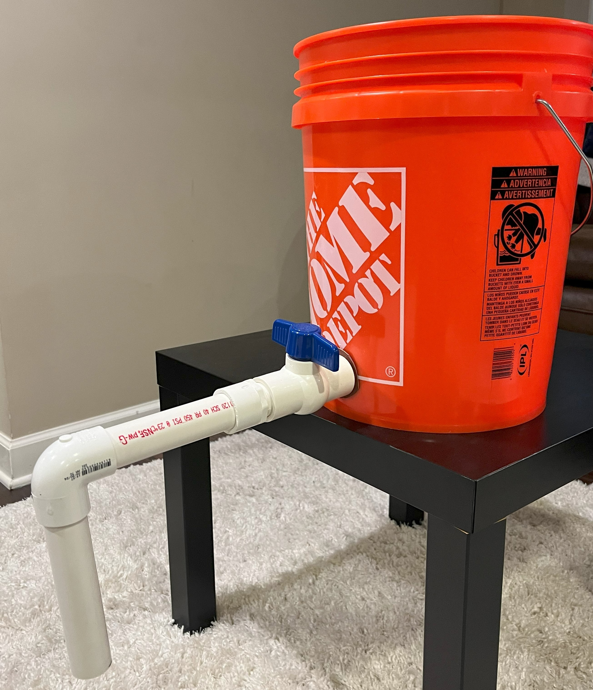

# ECE445 Senior Design Journal - Household Water Monitoring System - Daniel Baker

---

## Project Overview
**Project Name**: Household Water Monitoring System  
**Team Member(s)**: Daniel Baker (drbaker5)
**Date Started**: [Insert Start Date]  
**Course**: ECE445 Senior Design  

---

## Table of Contents
1. [Week 1](#week-1)
2. [Week 2](#week-2)
3. [Week 3](#week-3)
4. [Week 4](#week-4)
5. [Additional Weeks...](#additional-weeks)
6. [Final Reflection](#final-reflection)

---

## Week 1: [9/9-9/13]  
**Objectives for the Week**:  
- Identify high-level design of the project  
- Start first draft of project proposal  
- Meet with Mentor TA  

**Tasks Completed**:  
- Met with Mentor TA  
- Brainstormed many ideas for the project, including Smart Roulette Wheel and IoT Alarm  
- Landed on Household Water Monitoring System due to budgeting, difficulty, and feasibility constraints  
- Created a high-level block diagram for the design of the project  
- Made three high-level requirements for the design  
- Started the first draft of the project proposal  

---

## Week 2: [9/16-9/20]  
**Objectives for the Week**:  
- Finalize all parts and design  
- Submit finished project proposal  

**Tasks Completed**:  
- Finalized first draft of the design  
- Submitted the project proposal  

---

## Week 3: [9/23-9/27]  
**Objectives for the Week**:  
- Meet with Mentor TA to finalize and correct the project proposal  
- Correct project proposal to reflect TA suggestions  

**Tasks Completed**:  
- Met with Mentor TA 
- Revised project proposal based on TA suggestions, including:
    - Created more specific subsystem requirements with detailed unit tests for each  
    - Created quantifiable high-level design requirements  

---

## Week 4: [9/30-10/4]  
**Objectives for the Week**:  
- Submit revised project proposal,  
- Finish and submit design document  

**Tasks Completed**:  
- Submitted project proposal revision
- Completed and submitted the design document
    - Created draft physical design
        - ie: 
    - researched and finalized more specified ideas for each subsystem, and created RV tables for each
        - ie: 
    - finalized flow rate formula for ultrasonic subsystem
        - 

---

## Week 5: [10/7-10/11]  
**Objectives for the Week**:  
- Practice for Design Review
- Start PCB

**Tasks Completed**:  
- Practiced and completed design review presentation
    - Learned of timing challenges for flow rate, thus the need for very presiced time meaurement ICs
        - landed on TDC1000 and TDC7200 for time to digital conversion
- Started Microcontroller Subsystem for PCB
    -  

---

## Week 6: [10/14-10/18]  
**Objectives for the Week**: 
- Meet with TA Pusong Li 
- Complete and order first draft of PCB
- complete teamwork evaluation 1

**Tasks Completed**:
- Completed Power and Programming Subsystem
    - 
- Completed Ultrasonic Subsystem
    - 
- Completed first draft of routed PCB 
    - 
    
---

## Week 7: [10/21-10/25]  
**Objectives for the Week**:  
- Meet with TA Pusong Li
- Order components for PCB first draft

**Tasks Completed**:  
- Meet with TA Pusong Li
    - Recommended Breakout board for TDC chips for breadboard testing
- ordered parts from ECE parts shop for first draft of PCB
- submitted order for digikey for first draft of PCB
- Created test board with breakouts for TDC1000, TDC7200, OP Amps, and Ultrasonic Sensor Headers
    - 
    - 
    - 
- Submitted and ordered breakout board for second round of orders

---

## Week 8: [10/28-11/1]  
**Objectives for the Week**:  
- Meet with TA Pusong Li  
- solder and test pcb if it arrives

**Tasks Completed**:  
- Met with TA Pusong Li  
- PCB arrived 
    - 
- Soldered PCB 1
    - 
- worked on powering and programming PCB, but too small of diode footprint prevented us from programming. Scrapped PCB

---

## Week 9: [11/4-11/8]  
**Objectives for the Week**:  
- Meet with TA Pusong Li 
- make revisions to PCB based on errors from last PCB, and findings from breakout board if it arrives
- do individual progress report

**Tasks Completed**:  
- Met with TA Pusong Li  
- breakout board arrives
    - trying to program TDC1000 and TDC7200, no luck
    - trying to send and recieve signal to/from ultrasonic sensors. 
        - Thought we had luck, but found our wires from the oscilloscope were just acting as antennae
- started final PCB with revisions
    - add two programming methods: automatic with CP2102 USB UART bridge and one manual with buttons and headers for serial connection to use external bridge
    - remove op amps
    - add soft and hard reset buttons
    - add indication LEDS
    - change protection diodes for power and programming subsystem to be larger packages for easier soldering

---

## Week 10: [11/11-11/15]  
**Objectives for the Week**:  
- Meet with TA Pusong Li  
- complete and submit final PCB
- continue debugging breakout board and get ultrasonic sensors to send/recieve
- sign up for presentation and demo

**Tasks Completed**:  
- Met with TA Pusong Li  
- completed and submittetd final PCB
    - 
    - 
    - 
    - 
- continued debugging sensors and TDC chips, still no luck. 
    - Thinking of alternative solutions
        - using DAC and ADC to skip use of TDCs, use internal 80 MHz clock to measure time differences
            - no use, DAC and ADC use a different clock
        - use ultrasonic sensors given in 110 lab kit
            - will work, but lose ultrasonic subsystem points
- signed up for presentation and demo

---

## Week 11: [11/18-11/22]  
**Objectives for the Week**:  
- Meet with TA Pusong Li  
- continiue debugging
- mock demo
- sodler final pcb if it arrives

**Tasks Completed**:  
- Met with TA Pusong Li  
    - helped us try to debug sensors along with other TAs, could not get them to work
    - decided to focus on 110 lab kit ultrasonic sensors
- final PCB arrived, soldered it just before break. 
    - soldered headers to GPIOsand wires to voltage regulator so that we can get 5V, GND, and GPIO signals to external LCD and ultrasonic sensing module
    - 
- powered the PCB, but no luck programming

---

## Week 12: [11/25-11/29]  
**Objectives for the Week**:  
- eat food on thanksgiving
- continue to try to program
- make the demo setup

**Tasks Completed**:  
- Ate food
- met with partner to work on programming, no luck
- successfully made the demo setup
    - 

---

## Week 13: [12/2-12/6]  
**Objectives for the Week**:  
- Meet with TA Pusong Li to try to help us program
- get everything working (uh oh)
- final demo

**Tasks Completed**:  
- Met with TA Pusong Li, figured out that we needed to cut a couple traces to program the PCB. Programmed!
- code from partner worked somewhat, debugged software
- 3D printed enclosure for demo
    - 
    - 
- setup for final demo
- did the final demo
 

---

## Week 14: [12/9-12/13]  
**Objectives for the Week**:  
- Complete slides for final presentation
- do the final presentation
- complete demo video for extra credit
- complete final paper

**Tasks Completed**:  
- Completed slides for final presentation
- did the final presentation
- completed demo video for extra credit
- completed final paper
- ate dominoes to celebrate

---
